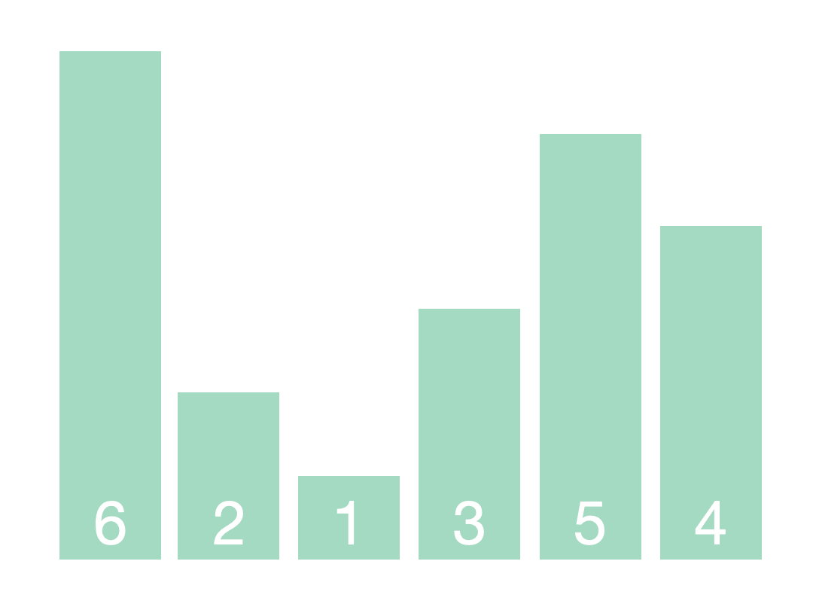

# 冒泡排序




冒泡排序是入门级的算法，但也有一些有趣的玩法。通常来说，冒泡排序有三种写法：

* 一边比较一边向后两两交换，将最大值 / 最小值冒泡到最后一位； 
* 经过优化的写法：使用一个变量记录当前轮次的比较是否发生过交换，如果没有发生交换表示已经有序，不再继续排序； 
* 进一步优化的写法：除了使用变量记录当前轮次是否发生交换外，再使用一个变量记录上次发生交换的位置，下一轮排序时到达上次交换的位置就停止比较。

```cpp
template<typename Iterator>
void BubbleSort(const Iterator begin, const Iterator end)
{                
    //迭代器指向对象的值类型                                                                                                                                                                                                                        
    using value_type = typename std::iterator_traits<Iterator>::value_type;
    
    auto size=std::distance(begin, end);
    if(size <= 1) return;
    
    for(auto current = begin; current != end - 1; current++){ 
        for(auto left = begin; left != current; left++){
            if(*left >  *(left+1)){
                value_type temp_value = *left;
                *left = *(left+1);
                *(left+1) = temp_value;
            }
        }
    }   
}

// std::vector<int> vec = {1, 5, 3, 6, 2, 4, 7};
// BubbleSort(vec.begin(), vec.end());

// int array[7] =  {1, 5, 3, 6, 2, 4, 7};
// BubbleSort(array, array+7);
```

* 最外层的 for 循环每经过一轮，剩余数字中的最大值就会被移动到当前轮次的最后一位，中途也会有一些相邻的数字经过交换变得有序。总共比较次数是\(n-1\)+\(n-2\)+\(n-3\)+…+1。
* 这种写法相当于相邻的数字两两比较，并且规定：“谁大谁站右边”。经过 n-1 轮，数字就从小到大排序完成了。整个过程看起来就像一个个气泡不断上浮，这也是“冒泡排序法”名字的由来。

> 引入第三个中间变量就完成了两个数字的交换：
>
> ```text
> //方法一: 求和法
> vec[j + 1] = vec[j] + vec[j+1];
> vec[j] = vec[j + 1] - vec[j];
> vec[j + 1] = vec[j + 1] - vec[j];
>
> //方法二: 异或法
> vec[j + 1] = vec[j] ^ vec[j + 1];
> vec[j] = vec[j + 1] ^ vec[j];
> vec[j + 1] = vec[j + 1] ^ vec[j];
> ```


